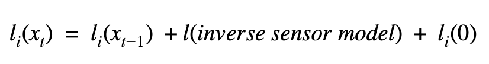
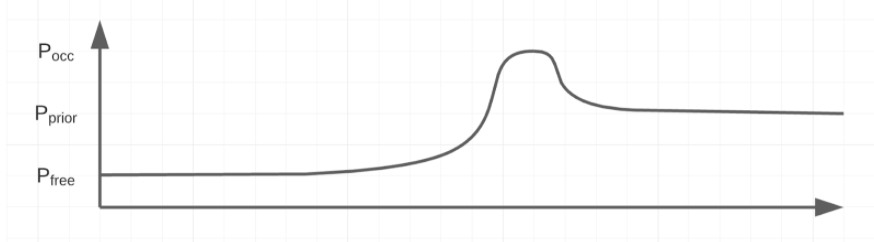
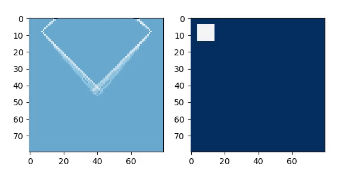
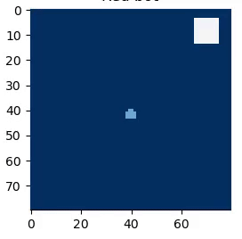
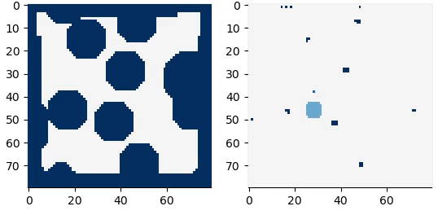

# The Environment Manager:

__Summary:__

The 'environment manager' is a subsystem within our controller structure which handles environment mapping, exploration, block detection and optimum approach vector generation

The main algorithms include mapping with known poses, difference of gaussian blob detection, and exploration using binary entropy.

### Mapping with known poses
 
We discretise the environment into grid cells corresponding to 3x3cm regions. We then map with known poses to fill in this binary occupancy grid. This allows for a likely map of the environment to be drawn. In the visualisation, we show the occupied regions as dark blue, free space as white and unknown regions as light blue. The higher the probability of occupation, the darker the colour i.e. P(Region = occupied) = 1. We are recursively updating the binary occupancy grid map probabilities whenever we receive new sensor data regarding this position on the map. (Shown below in log-odds notation).

  

The inverse sensor model shown below allows us to account for uncertainty in the sensor data as well as adjust to dynamic environments through repeated measurements. In the binary occupancy grid shown above, we have manually implemented sensor noise in simulation, however with repeated passes we attain an accurate map.

  

Through this method, we are able continuously map and update the environment so as to attain highly accurate maps, even with significant sensor noise. The example shown below illustrates both robots working together to generate a unified map of the environment, which in this case initially contains a single block (which is subsequently detected and appropriate padding applied).

  

### Block detection using difference of Gaussain:

Once we have attained our occupancy grid of probabilities, it is then treated as a grayscale image in order to perform blob detection. Given that the grid is often highly noisy, we then apply thresholding and denoising to improve the raw occupancy grid image quality. The DoG algorithm is then applied. Given that we know the size of the blocks in relation to the grid space, we are then able to filter based upon the resulting standard deviations, thus attaining incredibly reliable and accurate block positions, even when blocks are close to walls or to other blocks. This is shown above, where as soon as the environment is confident enough in its block predictions, the region is padded and targetted. 

### Exploration using binary entropy:

We treat each occupancy grid cell as an independant binary random variable. As such, we are then able to calculate the binary entropy for each grid cell given our found p, the probability of there being an obstacle within this grid cell. As such, we are able to determine the most 'uncertain' regions of the environment, and path plan towards these locations. This is a robust and direct method of finding new blocks/filling out our occupancy grid.

  

### Optimum approach vector:

In many cases, issues arise when blocks are either close together, or close to walls. As such, this restricts the directions with which we are able to approach blocks in order to detect their colour and grasp them. In order to prevent sub-optimal approaches, we combine each obstacles position vector with respect to the target location and weight them non-linearly (tanh). As such, we are able to attain the best position and orientation with which to approach the target from. This is shown in the visualisation below:

  

#### Contents:

- [__Overall system__](software_main.md)
- Controller structure
    + [__Robot manager__](robot_manager.md) - *Path planning, low level robot states*
    + [Environment manager](environment_manager.md) - *Mapping and low level decision making*
    + [__State manager__](state_manager.md) - *High level decision making*
- Code Structure - *Best practises and code snippets*
