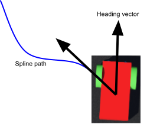
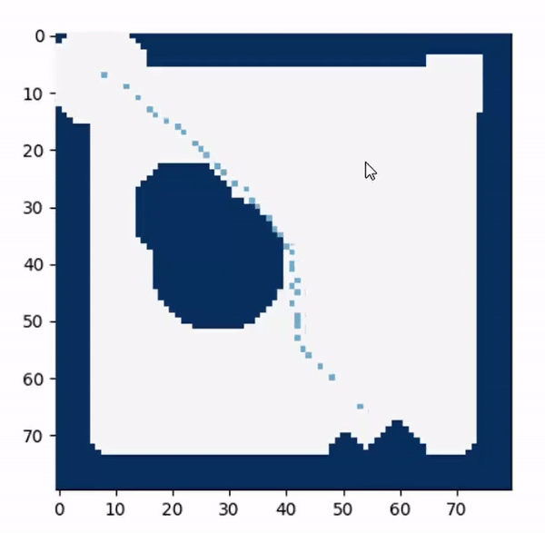

# The Robot Manager:

__Summary:__

The 'robot manager' is a subsystem within our controller structure which handles low level robot control (converting robot states to wheel and gripper position before transmission), path planning, and robot state parsing and execution. 

The main algorithms include A* and Dijkstra's path generation, spline curve generation to better fit the robots dynamics.

### Path planning algorithms:
 
At each loop iteration if the robot needs to go somewhere it firsts checks if a straight line path to the target is possible and if so follows this straight line path. However if at the current loop iteration it is no longer possible to follow a 
straight path we have implemented A* to generate the shortest path from the current location to the end location through the occupancy grid. Repeating this every loop iteration means a new path is generated every time to reflect the current environment allowing it to handle the dynamic environment well.
Once the series of points is generated we achieve smoother robot dynamics by then creating a less 
jerky path to follow. To do this we generate a spline curve of the path which reduces the numbers of points on the path and leads to smoother robot motion.

<p align="center">
     
</p>


In order to follow the path we have an effective proportional control method based on the dot product and cross product of the current heading vector and the vector from the current to next point on the path. The wheels of the robot are fed a 
a combination of a common mode signal and a differential mode signal the former of which creates translational motion and the later rotational. The differential signal is proportional to the cross product of the vectors as this causes it to aim to reduce
the angle between the vectors(ie aim its heading on the path) This also has the added benefit of taking care of the sense of the rotation as this is included in the sign of the cross product. The common mode signal is proportional to the dot product 
which means it aims to decrease the size of the vector from the current to next point in the path(ie follow the path). 

```
leftSpeed = pd*dot + pc*cross
rightSpeed = pd*dot - pc*cross
```

### Robot manager code structure:

The robot manager code structure is consistent and modular to allow for ease of bug fixing and additions. Shown below is a robot manager skeleton:

```
# General Robot manager class definition

class robot_manager:
    def __init__(self, robot_id, emitter):
        ''' Robot manager class
        attributes:
            robot_id: int - id of robot (used in comms)
            emitter: emitter object - (used in comms)
        '''
        self.robot_id = robot_id
        self.state = ['idle', {}]
        self.robot_data = None
        self.emitter = emitter

    def __call__(self):
        ''' Executes the state function at each timestep
        '''
        return getattr(self, self.state[0])(self.state[1] if len(self.state[1]) > 0 else None)

    def set_robot_state(self, wheel_v, gripper):
        message = struct.pack('iddi', self.robot_id, np.clip(wheel_v[0], -10,10), np.clip(wheel_v[1],-10,10),  gripper)
        self.emitter.send(message)

    def set_state(self, state_function, *args ,**kwargs):
        if state_function:
            self.state[0] = state_function
            if len(args) > 0:
                self.state[1] = args[0]
            else:
                self.state[1] = kwargs

    # convention for state defs: use dict of args even if not needed
    def idle(self, args):
        if args:
            if 'grip' in args:
                self.set_robot_state([0,0], args['grip'])
            else:
                self.set_robot_state([0,0], 0)
        else:
            self.set_robot_state([0,0], 0)

    # utility functions as normal
```

As shown above, this is the barebones requirements for the robot manager class. I.e. we require a method of sending low level controls to the robot, a method of executing the state at each timestep, a method of setting the state at any arbitrary timestep, and an idle state to act as our base robot state. 

An example use is shown below, whereby we initialise our robot manager with an id and an emitter. We feed the robot manager information and execute the state function (idle, etc) at each timestep. The state can be updated at any point, synchronously or asynchronously:

```
red_bot = robot_manager(0, emitter)

while master_robot.step(TIME_STEP) != -1:

    ### Stuff

    red_bot.robot_data = robot_data

    ### More Stuff

    if something:
        red_bot.set_state('state', kwarg1 = a, kwarg2 = b)

    ### Even more stuff

    red_bot()

```

Best practises:
- Only feed the managers the information that they really need
- When defining a state, make sure to follow state convention
- Specific utility functions should be kept within the class, useful utility functions should be external
- make sure to call the manager at each timestep

#### Contents:

- [__Overall system__](software_main.md)
- Controller structure
    + [Robot manager](robot_manager.md) - *Path planning, low level robot states*
    + [__Environment manager__](environment_manager.md) - *Mapping and low level decision making*
    + [__State manager__](state_manager.md) - *High level decision making*
- Code Structure - *Best practises and code snippets*


