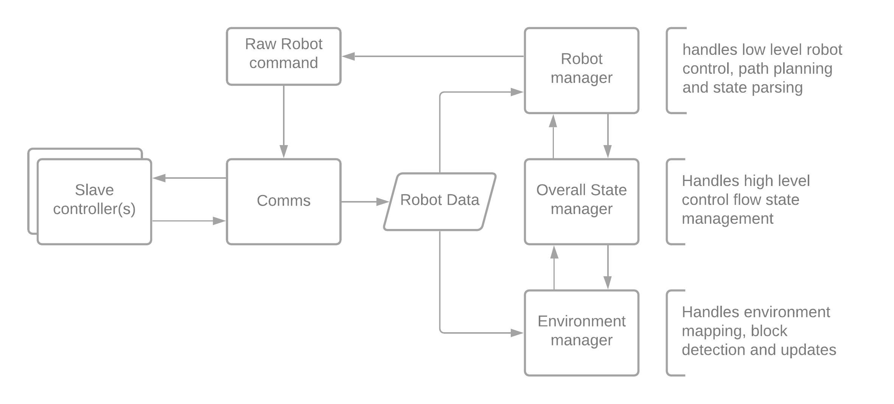
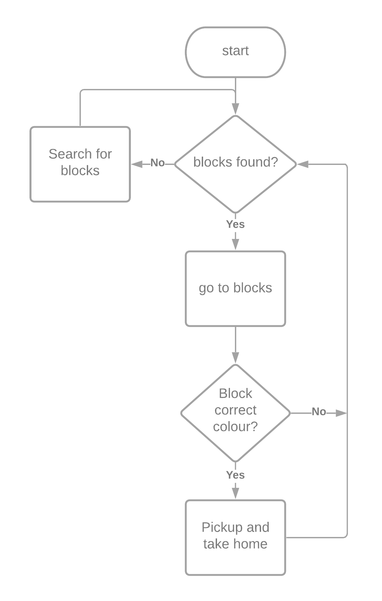

# Software Documentation

The final software is included with the final webots world within the 'final_comp' folder [here](github.com/BengineerZ/2CW_IDP/tree/main/final_comp)

#### Contents:

- [Overall system](software_main.md)
- Controller structure
    + [__Robot manager__](robot_manager.md) - *Path planning, low level robot states*
    + [__Environment manager__](environment_manager.md) - *Mapping and low level decision making*
    + [__State manager__](state_manager.md) - *High level decision making*

## Overall system:

This section will provide an overview of the control flow of the full system, including a simplified version of subsystem diagram and decision tree

---

The controller structure is based off of a 'master'/'slave' system, whereby the master controller has almost full control over the low level actuation of both robots. The following diagram illustrates the overarching flow of information within the system:

A significantly simplified overall decision process for the system is show below - a more complicated and extensive graphical representation of the binary decision tree is shown here: TODO: ADD IN LINKS.

  

### Algorithm/innovative approach Summary:

Throughout this whole process, the main focus has been on creating a well integrated phsically reliable system – something that will actully work in reality. Notably, we have included significant sensor noise (and after the first competition restricted range). As such, our algorithms reflect the robust and adaptable control needed to function in a real-world situation:

- We utilise __mapping with known poses__ to continuously update our environments binary occupancy grid. As such, we are able to react even to non-static environments. 
- Our unique approach to detecting blocks given a noisy an often-incomplete occupancy grid is to perform a __difference of gaussian blob detection__ algorithm. As such, we are able to rapidly generate highly accurate maps of the environment from real world equivalent sensor data. 
- We use __A*__ to then generate the fastest paths to our target 
- We approximate __differential drive vehicle dynamics using spline curves__ to generate a more optimal path condusive to our mechanical design
- We use adaptive systems that allow the robot to safely path plan out non-driveable area (__Dijkstra__)
- We employ __approach vector weighting__ to find the optimal approach angle for each block under more difficult conditions
- We leverage the __occupancy grids binary entropy__ (Finding the highest regions of uncertainty) in order to explore for new blocks. 
- The __modular controller__ allows for rapid debugging and easy prototying as a result of the binary tree datastructure which we use to generate robot states and transitions.

Click for more details on [__mapping and exploration__](environment_manager.md)

Click for more details on [__path planning and low level robot control__](robot_manager.md)

Click for more details on the [__overall strategy and decision tree__](state_manager.md)

