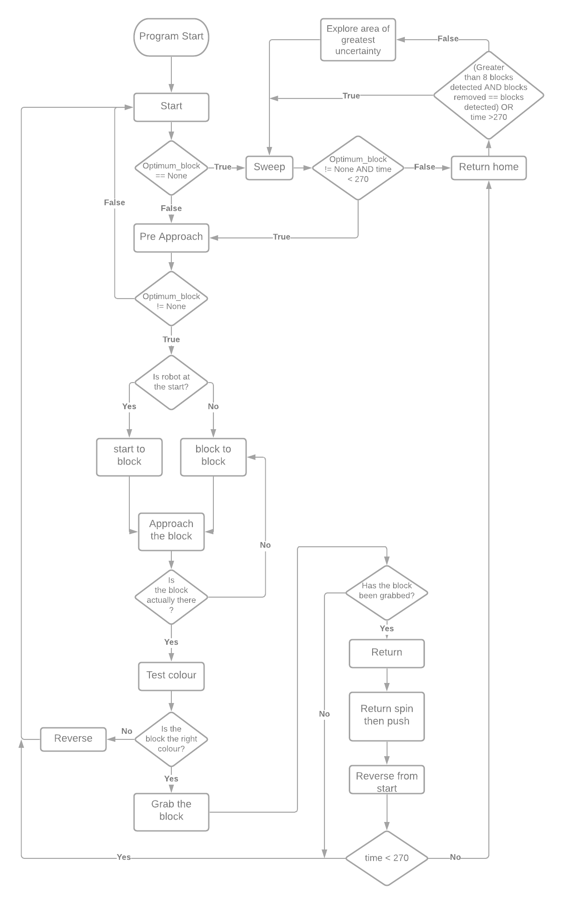

# The State Manager:

__Summary:__

The 'State Manager' is the subsystem that handles the control flow of the processes the robots execute allowing the overall block collecting strategy to be implemented.

### The Conrol Strategy 
<p align="center">
  
</p>

### The Implementation

The robot_state_manager class has a task tree attribute which is a dictionary populated with task nodes. These task nodes define the flow of the subroutines the robot executes by defining how the next tasks branch out from the current one.

The task nodes take the following form:
```
self.task_tree["TASK"] = {
	"next": "NEXT_TASK",
	"next_alt": "ALTERNATIVE_NEXT_TASK",
	"condition": lambda env, robot: CONDITION
```
Each task node leads to the next node based on a condition defined in the "condition". If the condition evaluates True then the next task is returned otherwise the alternative next task is returned to be executed.

This allows new tasks to be easily added and slotted into the control flow allowing for easy prototyping and adaptation.

The state manager at each loop checks if the robot is idle if it is not idle it means it is currently executing some other subroutine in which case it does nothing. The very last command of any subroutine sets the robot to idle.
Therefore if the state manager checks and the robot is in the idle state it assumes the current task has just been completed and it will execute the next subroutine by evaluating what the next task should be as defined by the task tree node of the task it just executed.
These tasks are executed by converting them into a state with the "make_robot_state_from_task" function which returns a subroutine in the robot manager class which the robot manager can then execute.

Adding a new task requires a new task node to be defined as above in the task tree and an accompanying subroutine that can run by the robot manager must be added to the make_robot_state_from_task function by adding a corresponding elif statement of the form below:

```
elif self.current_task == "TASK":
	return ["ROBOT_MANAGER_FUNCTION", {ARGUMENTS FOR FUNCTION}]
```

#### Contents:

- [__Overall system__](software_main.md)
- Controller structure
    + [__Robot manager__](robot_manager.md) - *Path planning, low level robot states*
    + [__Environment manager__](environment_manager.md) - *Mapping and low level decision making*
    + [State manager](state_manager.md) - *High level decision making*
- Code Structure - *Best practises and code snippets*
